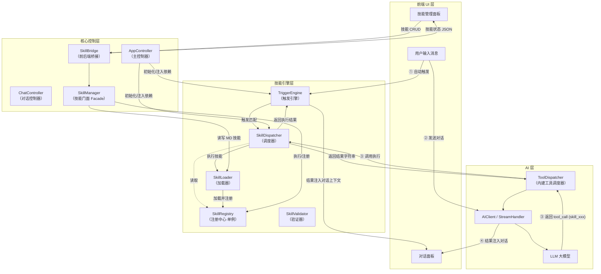
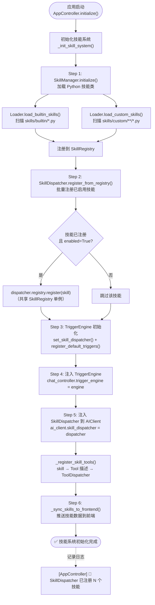
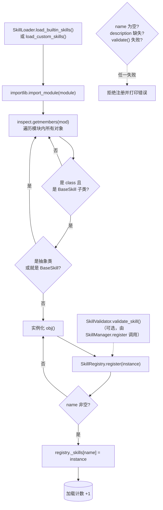
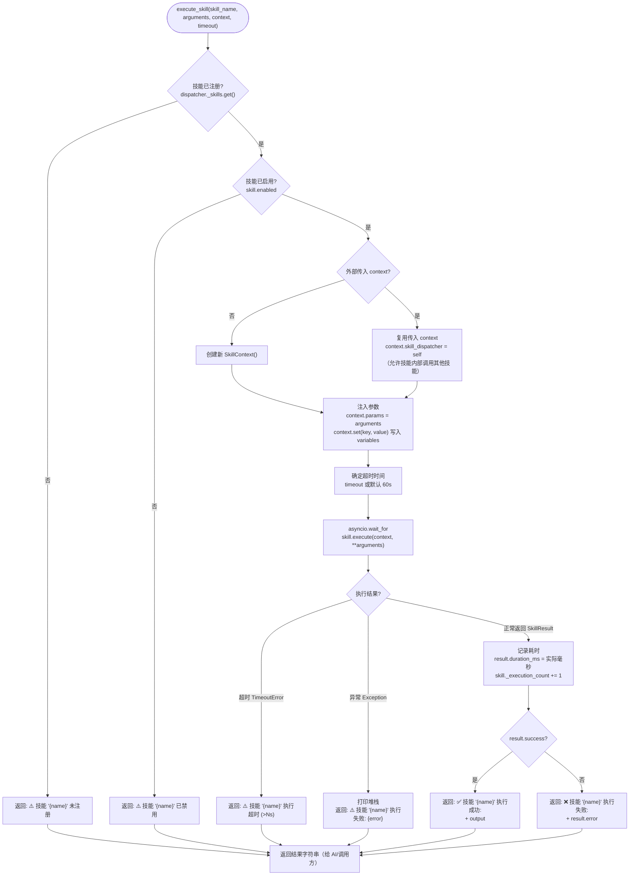
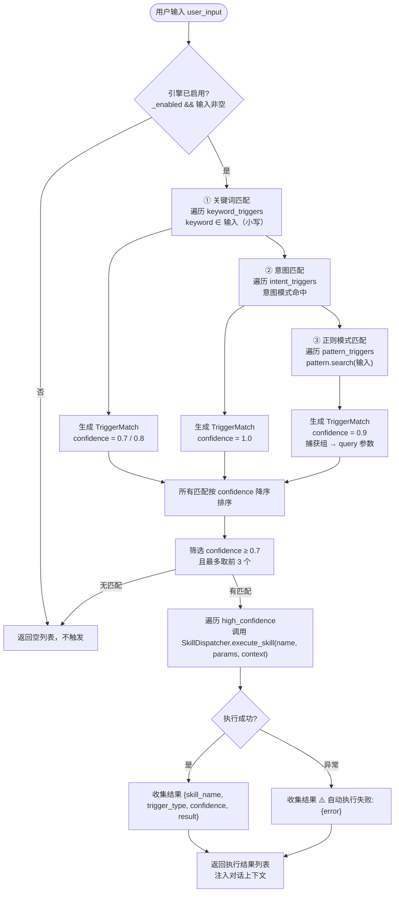
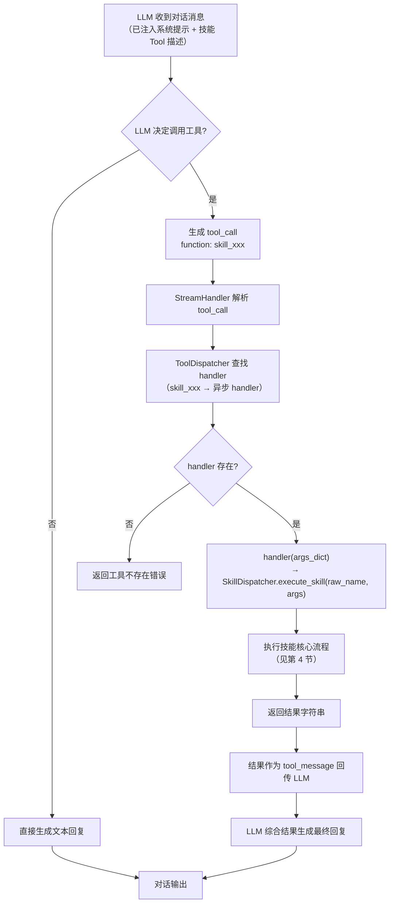
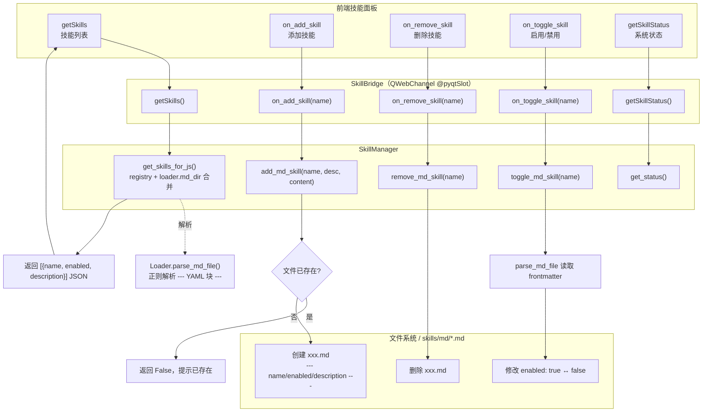
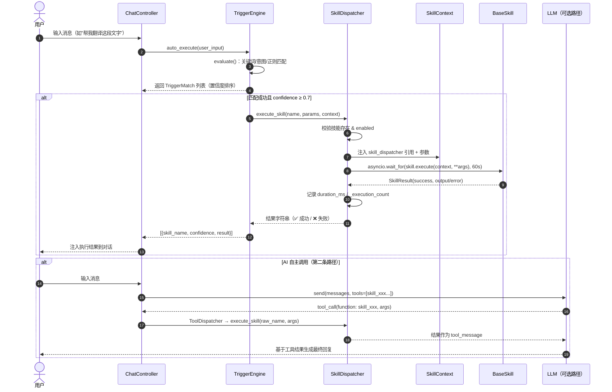
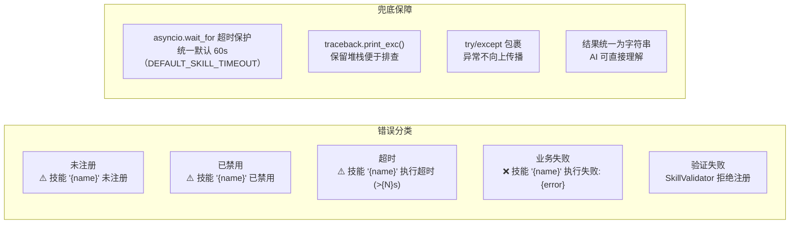
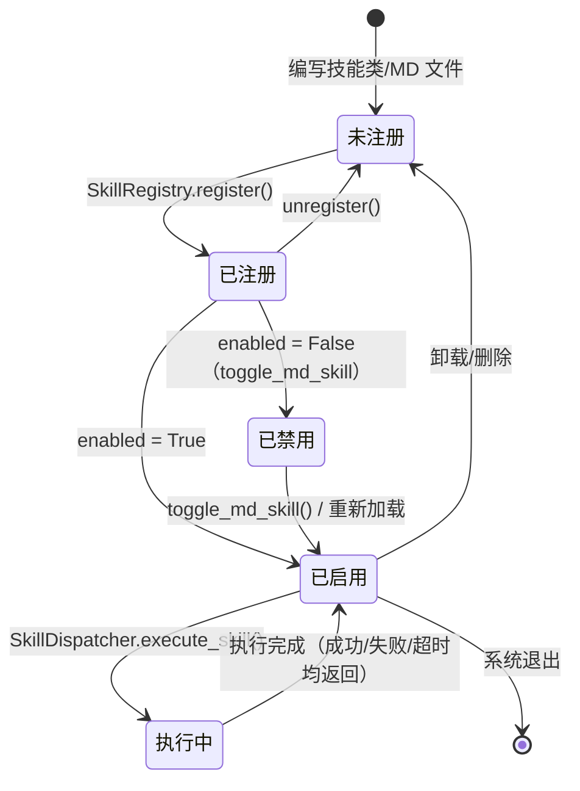

# Skill 技能系统 — 业务流程图

> 本文档基于 `skills/` 模块、`ai/skill_dispatcher.py`、`controller/app_controller.py`、`bridge/skill_bridge.py` 的实际实现绘制，覆盖技能系统的**初始化、加载注册、触发执行、AI 工具调用、技能管理**等核心业务流程。
>
> 图例：`flowchart` 为业务流程图，`sequenceDiagram` 为时序图，`stateDiagram` 为状态流转图。文中标注的类名/方法名均与代码一一对应，可用于快速定位实现。

---

## 目录

- [1. 系统整体业务流程图](#1-系统整体业务流程图)
- [2. 技能系统初始化流程](#2-技能系统初始化流程)
- [3. 技能加载与注册流程](#3-技能加载与注册流程)
- [4. 技能执行核心流程](#4-技能执行核心流程)
- [5. 自动触发流程（TriggerEngine）](#5-自动触发流程triggerengine)
- [6. AI 工具调用执行流程](#6-ai-工具调用执行流程)
- [7. MD 技能管理流程](#7-md-技能管理流程)
- [8. 技能执行时序图](#8-技能执行时序图)
- [9. 异常处理与错误码](#9-异常处理与错误码)
- [10. 技能状态流转](#10-技能状态流转)

---

## 1. 系统整体业务流程图

展示用户输入 → 触发/调用 → 执行 → 返回结果的**完整业务闭环**。



**执行路径说明：**

| 路径 | 入口 | 调用链 | 适用场景 |
|------|------|--------|----------|
| ① 自动触发 | `ChatController` | `TriggerEngine.auto_execute()` → `SkillDispatcher.execute_skill()` | 用户输入命中关键词/意图/正则模式 |
| ② AI 工具调用 | `AIClient` | LLM 生成 `tool_call` → `ToolDispatcher` → `SkillDispatcher.execute_skill()` | LLM 自主决策调用技能 |
| ③ 直接执行 | 任意代码 | `SkillManager.execute()` → `SkillExecutor.execute()` | 程序化调用（测试/插件） |

---

## 2. 技能系统初始化流程

对应实现：`AppController._init_skill_system()`（`controller/app_controller.py:203`）



> **注意**：`SkillManager`、`SkillDispatcher`、`SkillExecutor` 共享**同一个单例 `SkillRegistry`**，因此技能在执行时无需额外同步。

---

## 3. 技能加载与注册流程

对应实现：`SkillLoader._load_from_module()`（`skills/loader.py:64`）、`SkillRegistry.register()`（`skills/registry.py:19`）



**加载来源：**

| 来源 | 目录 | 说明 |
|------|------|------|
| 内建技能（Python） | `skills/builtin/*.py` | 11 个内置技能：翻译、总结、代码助手、文档写作、邮件、会议纪要、头脑风暴、问题求解、数据导出、数据分析、网页抓取 |
| 自定义技能（Python） | `skills/custom/**/*.py` | 递归扫描子目录，支持分层模块 |
| MD 技能（提示词） | `skills/md/*.md` | 通过 YAML Frontmatter（`name/enabled/description`）声明，正文为提示词 |

---

## 4. 技能执行核心流程

对应实现：`SkillDispatcher.execute_skill()`（`ai/skill_dispatcher.py:127`）



> **核心设计**：
> - 执行使用 `asyncio.wait_for` 包裹，保证**超时可控**（`SkillExecutor` / `SkillDispatcher` 统一默认 60 秒，共享常量 `DEFAULT_SKILL_TIMEOUT`）。
> - `SkillContext` 中注入 `skill_dispatcher` 引用，使技能可以**嵌套调用其他技能**。
> - 参数会同时注入 `context.params` 与 `context.variables`，技能通过 `kwargs` 或 `context.get()` 两种方式读取。

---

## 5. 自动触发流程（TriggerEngine）

对应实现：`TriggerEngine.evaluate()` 与 `TriggerEngine.auto_execute()`（`skills/trigger_engine.py:114/171`）



**默认触发器配置**（`register_default_triggers`）：

| 技能 | 触发关键词示例 | 正则模式 |
|------|---------------|---------|
| translator 翻译 | 翻译 / translate / 英译中 / 翻一下 | `把「...」翻译成 \w+` |
| summarizer 总结 | 总结 / 摘要 / 概括 / 提炼 | — |
| code_assistant 代码助手 | 代码审查 / debug / 重构 | `帮我审查这段代码` |
| web_scraper 网页抓取 | 抓取网页 / 爬取 / scrape | — |
| email_composer 写邮件 | 写邮件 / 起草邮件 | — |
| meeting_minutes 会议纪要 | 会议纪要 / 会议记录 | — |
| brainstorming 头脑风暴 | 头脑风暴 / 想点子 | — |
| problem_solver 问题求解 | 解决问题 / 根因分析 | — |
| document_writer 写文档 | 写文档 / 技术文档 | — |

---

## 6. AI 工具调用执行流程

对应实现：`AppController._register_skill_tools()`（`controller/app_controller.py:299`）、`AIClient._get_skill_tools()`（`ai/client.py:336`）



> **实现要点**：
> - 每个 skill 生成的 Tool 名称为 `skill_<name>`，注册到 `ToolDispatcher` 时提取原始名称 `raw_name` 作为 `execute_skill` 的第一个参数。
> - 工具描述符合 OpenAI/MCP 兼容的 function-call 格式（`type: function`），`input_schema` 由技能类显式定义，未定义时使用默认 `{query: string}`。
> - 系统提示词通过 `loader.get_combined_prompt()` 将启用的 **MD 技能** 合并为 `## 技能指令` 段落注入。

---

## 7. MD 技能管理流程

对应实现：`SkillBridge`（`bridge/skill_bridge.py`）+ `SkillManager` MD 相关方法（`skills/manager.py`）



**运行时注册到 AI：** 上传 / 删除 / 启用切换后，`SkillBridge` 会调用 `AppController._resync_md_skill_tools()`：先把当前已注册的 MD 适配器注销，再将磁盘上已启用的 MD 技能重新注册为可执行适配器（`SkillManager.sync_md_skills_to_registry()`），并同步 `skill_<name>` 工具处理器到 `ai_client.tool_dispatcher`，使 AI 能即时感知新增 / 禁用 / 删除的技能（无需重启应用）。

**MD 技能文件格式：**

```markdown
---
name: code-review
enabled: true
description: 代码审查技能提示词
---

（技能提示词正文，将被注入系统提示词）
```

**管理操作与前端消息反馈：**

| 操作 | 方法 | 成功反馈 | 失败反馈 |
|------|------|---------|---------|
| 添加 | `on_add_skill` | `✅ 技能 "x" 已添加。` | `⚠️ 技能 "x" 已存在或名称无效。` |
| 删除 | `on_remove_skill` | `🗑️ 技能 "x" 已删除。` | — |
| 切换 | `on_toggle_skill` | `🔄 技能 "x" 已启用/禁用。` | — |

---

## 8. 技能执行时序图

展示一次完整的**触发 → 执行 → 返回**时序（以 TriggerEngine 自动触发为例）：



---

## 9. 异常处理与错误码

对应实现：`SkillDispatcher.execute_skill()` 的异常分支与 `SkillExecutor.execute()`



| 异常场景 | 检测点 | 返回值 | 代码位置 |
|---------|--------|--------|---------|
| 技能未注册 | `execute_skill` 入口 | `⚠️ 技能 'x' 未注册` | `ai/skill_dispatcher.py:147` |
| 技能已禁用 | `execute_skill` 入口 | `⚠️ 技能 'x' 已禁用` | `ai/skill_dispatcher.py:149` |
| 执行超时 | `asyncio.wait_for` | `⚠️ 技能 'x' 执行超时 (>{N}s)` | `ai/skill_dispatcher.py:178` |
| 执行异常 | 捕获 `Exception` | `⚠️ 技能 'x' 执行失败: {error}` | `ai/skill_dispatcher.py:180` |
| 技能不合法 | `SkillValidator.validate_skill` | 拒绝注册 + 错误列表 | `skills/validator.py:12` |
| 名称非法 | `SkillValidator.validate_name` | 仅允许字母/数字/下划线/连字符 | `skills/validator.py:43` |

---

## 10. 技能状态流转



**状态说明：**

| 状态 | 含义 | 判断条件 |
|------|------|---------|
| 未注册 | 尚未进入 Registry | `registry.get(name) is None` |
| 已注册 | 已注册但禁用 | 注册成功，`enabled = False` |
| 已启用 | 可被触发/调用 | `enabled = True` 且已注册 |
| 执行中 | 正在异步执行 | `asyncio.wait_for` 包裹期间 |
| 已禁用 | 拒绝执行 | `execute_skill` 直接返回禁用提示 |

---

## 附：核心类与职责速查

| 类 | 所在文件 | 职责 |
|----|---------|------|
| `BaseSkill` | `skills/base.py` | 技能抽象基类，子类实现 `execute()`，声明 `name/description/input_schema` |
| `SkillResult` | `skills/base.py` | 执行结果数据类（success/output/error/duration_ms/metadata） |
| `SkillContext` | `skills/context.py` | 执行上下文（用户输入、会话、参数、变量、调度器引用） |
| `SkillRegistry` | `skills/registry.py` | 单例注册中心，技能按名称注册/查找/分类 |
| `SkillLoader` | `skills/loader.py` | 加载 Python 技能类 + 解析 MD 技能文件 |
| `SkillExecutor` | `skills/executor.py` | 技能执行器（批量/分类执行，超时保护） |
| `SkillValidator` | `skills/validator.py` | 技能配置与执行参数校验 |
| `SkillManager` | `skills/manager.py` | 统一门面：加载/注册/执行/MD 管理/前端桥接 |
| `SkillDispatcher` | `ai/skill_dispatcher.py` | AI 工具化调度：Tool 描述生成 + 异步执行 |
| `TriggerEngine` | `skills/trigger_engine.py` | 触发评估引擎：关键词/意图/正则/上下文/时间/事件匹配 + 自动执行 |
| `MdSkill` | `skills/md_skill.py` | MD 技能适配器：将 Markdown 技能包装为可执行 BaseSkill |
| `SkillBridge` | `bridge/skill_bridge.py` | QWebChannel 桥接，前端技能管理接口 |

---

## 附：优化记录

基于代码审查实施的优化项（与流程图中的实现保持一致）：

| 阶段 | 优化项 | 涉及文件 |
|------|--------|---------|
| 第 1 轮 | ① 修复意图触发器"注册但永不触发"的 bug | `skills/trigger_engine.py` |
| 第 1 轮 | ② 统一 `SkillExecutor` / `SkillDispatcher` 默认超时（`DEFAULT_SKILL_TIMEOUT = 60s`） | `skills/base.py`、`skills/executor.py` |
| 第 1 轮 | ③ `SkillDispatcher` 委托单例 `SkillRegistry`，消除双注册中心 | `ai/skill_dispatcher.py` |
| 第 1 轮 | ④ `SkillRegistry.register()` 统一校验入口 | `skills/registry.py` |
| 第 1 轮 | ⑤ 自动触发按技能名去重 + 每次执行独立上下文 | `skills/trigger_engine.py` |
| 第 1 轮 | ⑥ MD 技能文件 mtime 缓存 | `skills/loader.py` |
| 第 2 轮 | ⑦ `execute_all` / `execute_by_category` 并发执行（`asyncio.gather`） | `skills/executor.py` |
| 第 2 轮 | ⑧ 技能生命周期钩子 `on_load / on_unload / on_enable / on_disable` + `set_enabled` / `toggle_enabled` | `skills/base.py`、`skills/registry.py` |
| 第 2 轮 | ⑨ 声明式触发器元数据 `BaseSkill.triggers`，加载时自动注册 | `skills/base.py`、`skills/trigger_engine.py`、`controller/app_controller.py` |
| 第 2 轮 | ⑩ 技能生命周期事件接入 EventBus（`skill:registered / unregistered / toggle`） | `skills/registry.py`、`controller/app_controller.py` |
| 第 3 轮 | ⑪ TriggerEngine 集成全部 6 类触发器（关键词/意图/正则/上下文/时间/事件），消除死代码 | `skills/trigger_engine.py` |
| 第 3 轮 | ⑫ `SkillDispatcher` 执行历史记录（`execution_history`，成功/失败/超时/未注册均记录） | `ai/skill_dispatcher.py` |
| 第 3 轮 | ⑬ MD 技能适配器 `MdSkill`（将 Markdown 技能包装为可执行 BaseSkill，统一技能模型） | `skills/md_skill.py`、`skills/loader.py` |
| 第 4 轮 | ⑭ 前端数据源统一：`get_skills_for_js` 聚合 Python+MD、`_sync_to_js` 指向 `appState`、SkillBridge 变异后统一刷新 | `skills/manager.py`、`bridge/skill_bridge.py` |
| 第 4 轮 | ⑮ MD 技能注册为 AI 工具（`enable_md_skill_tools` 开关，默认开启） | `controller/app_controller.py`、`skills/md_skill.py` |


---

*文档生成日期：2026-07-31 · 基于当前代码库实现绘制。若模块逻辑变更，请同步更新本图。*


